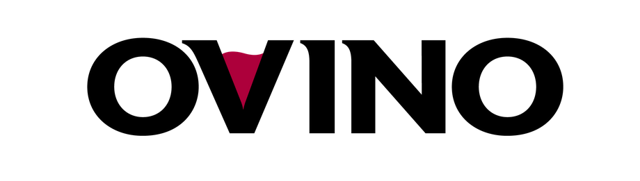

<!-- Improved compatibility of back to top link: See: https://github.com/othneildrew/Best-README-Template/pull/73 -->

<!--
*** Thanks for checking out the Best-README-Template. If you have a suggestion
*** that would make this better, please fork the repo and create a pull request
*** or simply open an issue with the tag "enhancement".
*** Don't forget to give the project a star!
*** Thanks again! Now go create something AMAZING! :D
-->

<!-- PROJECT SHIELDS -->
<!--
*** I'm using markdown "reference style" links for readability.
*** Reference links are enclosed in brackets [ ] instead of parentheses ( ).
*** See the bottom of this document for the declaration of the reference variables
*** for contributors-url, forks-url, etc. This is an optional, concise syntax you may use.
*** https://www.markdownguide.org/basic-syntax/#reference-style-links
-->

<!-- PROJECT LOGO -->
 

  

<h3 align="center">OVINO</h3>

  

    A wine recommendation app that uses price-sentiment to rank bottles in Ontario, Canada. Built with Flask. 
     
    <a href="https://ovino.onrender.com/">View Demo. (Please wait 10s for bootup)</a>
  

<!-- ABOUT THE PROJECT -->
## About The Project

This repo contains my Flask app, OVINO, and is [hosted on Render](https://ovino.onrender.com). OVINO finds the nearest LCBO store to your location and displays wines with the "best-valued" wines. 

## How do you select the "best-valued" wines?

When I searched for a bottle on the popular wine app [Vivino](https://vivino.com), I found about 1-2% of reviews contain sentiment about the price. Below are some samples:
> [4.5 stars] "Excellent! Another great deal at Costco. $40" 
> [4.5 stars] "Beautiful wine!! A bargain at $65!!" 
> [3.0 stars] "Dry , I think can keep for a while longer … ripen berries , not too much tannin .. $35. Not a fan" 
> [3.0 stars] "Quite acidic at first, but much better after passing it through the aerator! Red fruits mostly, cranberry, red cherry, a bit of oak and a bit of the raisin. Paid 19$, definitely a good bargin"

I collect all of reviews containing prices and build a dataset with their sentiment. So, a given bottle with many reviews will have a distribution of {x: prices paid, y: price-sentiment}. Suppose the LCBO set a bottle's price as p. The vivino reviews we care about are from users (a) who paid more than p and thought it was worth it, and (b) who paid less than p and thought it was NOT worth it. The ratio of (a) and (b) gives a positivity index for LCBO's price, p. OVINO recommends the bottles at your nearest LCBO store and rank them by their positivity score. 

## How did you do this project?

For an explanation of how OVINO works, here is a short video of my capstone [presentation](https://www.youtube.com/watch?v=u7fpod5GeyY&t=1046s). 

Using Github Actions, I wrote a periodic web scraper that collects product information from LCBO. See here: https://github.com/royourboat/lcbo-wine-scraper

For each bottle of wine at LCBO, I found the corresponding Vivino page and scraped the reviews. This amounted to approximately 9 million reviews. A rules-based approach is sufficient to identify Vivino reviews containing prices. The next step is to train a model on the training set. Then, apply the model to the remaining reviews containing prices to create a data set of {x: prices paid, y: sentiment} for each bottle. 

Typically, a sentiment model (e.g., sentiment of Yelp reviews) is created by classifying 1-star and 5-star reviews as "negative" and "positive", respectively. This is a fast and easy method. I found this technique is able to recover approximately 82% (i.e., 1 in 5 is misclassified) when using 50k 1- and 5-star reviews as a training set.

To do better, I created a training set of 2000 reviews containing prices labeled with price-sentiments (positive/negative = 2). My price-sentiment model is a bag-of-words model trained on monograms and bigrams (after lemmatization) along with an SGD classifier. My model recovers 91% of the test set (i.e., 1 in 10 misclassified). I have ideas on how to do better (stay tuned!). 

## Why did you choose this project? 

TL;DR: It is too challenging for a novice like me to explore wine on a budget. 

I went to the LCBO and wanted to try wine. I didn't bother looking because (a) I don't know anything about wine, and (b) the of a bad experience for $20 is too high. As a cherry on top, the LCBO is a government-run corporation that has a complete monopoly on alcohol distributions in Ontario. There are suspicions and allegations of unfair practices that make me wonder if our government is ripping us off. 

The following solutions to find wine had either failed me or made me give up:
* I once asked for two wine recommendations from an official LCBO wine guide/staff. Their recommendations were shockingly bad. 
* If you take a picture of wine bottles, Vivino's app identifies them and returns the ratings. It is impractical to take pictures of 20 wine racks and wait more than 20-30 seconds for Vivino to identify them. Many bottles don't get identified. The vintage bottles aren't stacked vertically and need to be scanned individually.
* I found a couple bottles with 4+ star ratings on Vivino. Most wine reviews are not useful since they only contain flavour notes and some sentiment like "fantastic". Some reviews had red flags or warnings and gave 4 stars. 

What I eventually found helpful is the rare review containing the price someone paid and their sentiment for that price! If only we could aggregate all of this valuable price-sentiment information... :)

## Does it work?

You tell me! I bought two bottles recommended from my app and absolutely loved them. It was a complete shock that my app gave great recommendations. I'd like to buy more on a good occasion. I'm also trying to lose weight... but I calculated the total calories for every bottle, which may be useful for you too! To calculate calories, I used the alcohol percentage and reported sugar content from LCBO, the bottle volume, and some conversions between alcohol and sugar mass to calories. 

The app needs some more features! More are coming!!

<!-- LICENSE -->
## License

Distributed under the BSD 3-Clause License. See `LICENSE.txt` for more information.

(<a href="#readme-top">back to top</a>)

<!-- CONTACT -->
## Contact

Stephen Ro

(<a href="#readme-top">back to top</a>)

<!-- ACKNOWLEDGMENTS ->
## Acknowledgments

* 
* 
* 

(<a href="#readme-top">back to top</a>)

<!-- MARKDOWN LINKS & IMAGES -->
<!-- https://www.markdownguide.org/basic-syntax/#reference-style-links -->
[contributors-shield]: https://img.shields.io/github/contributors/github_username/repo_name.svg?style=for-the-badge
[contributors-url]: https://github.com/github_username/repo_name/graphs/contributors
[forks-shield]: https://img.shields.io/github/forks/github_username/repo_name.svg?style=for-the-badge
[forks-url]: https://github.com/github_username/repo_name/network/members
[stars-shield]: https://img.shields.io/github/stars/github_username/repo_name.svg?style=for-the-badge
[stars-url]: https://github.com/github_username/repo_name/stargazers
[issues-shield]: https://img.shields.io/github/issues/github_username/repo_name.svg?style=for-the-badge
[issues-url]: https://github.com/github_username/repo_name/issues
[license-shield]: https://img.shields.io/github/license/github_username/repo_name.svg?style=for-the-badge
[license-url]: https://github.com/github_username/repo_name/blob/master/LICENSE.txt
[linkedin-shield]: https://img.shields.io/badge/-LinkedIn-black.svg?style=for-the-badge&logo=linkedin&colorB=555
[linkedin-url]: https://linkedin.com/in/linkedin_username
[product-screenshot]: /static/images/ovino_screenshot.png
[Next.js]: https://img.shields.io/badge/next.js-000000?style=for-the-badge&logo=nextdotjs&logoColor=white
[Next-url]: https://nextjs.org/
[React.js]: https://img.shields.io/badge/React-20232A?style=for-the-badge&logo=react&logoColor=61DAFB
[React-url]: https://reactjs.org/
[Vue.js]: https://img.shields.io/badge/Vue.js-35495E?style=for-the-badge&logo=vuedotjs&logoColor=4FC08D
[Vue-url]: https://vuejs.org/
[Angular.io]: https://img.shields.io/badge/Angular-DD0031?style=for-the-badge&logo=angular&logoColor=white
[Angular-url]: https://angular.io/
[Svelte.dev]: https://img.shields.io/badge/Svelte-4A4A55?style=for-the-badge&logo=svelte&logoColor=FF3E00
[Svelte-url]: https://svelte.dev/
[Laravel.com]: https://img.shields.io/badge/Laravel-FF2D20?style=for-the-badge&logo=laravel&logoColor=white
[Laravel-url]: https://laravel.com
[Bootstrap.com]: https://img.shields.io/badge/Bootstrap-563D7C?style=for-the-badge&logo=bootstrap&logoColor=white
[Bootstrap-url]: https://getbootstrap.com
[JQuery.com]: https://img.shields.io/badge/jQuery-0769AD?style=for-the-badge&logo=jquery&logoColor=white
[JQuery-url]: https://jquery.com 
